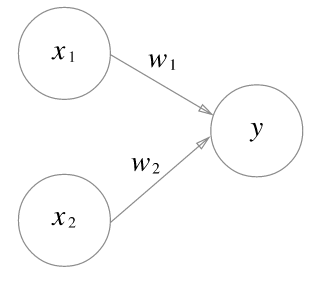
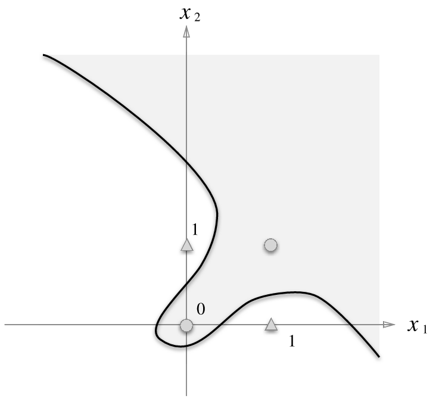
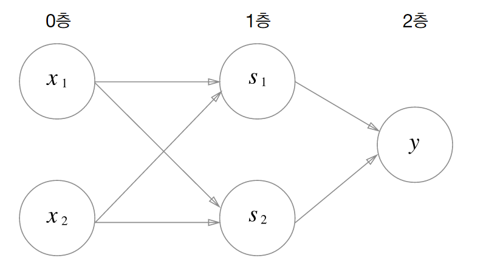

# 퍼셉트론

### 2.1 퍼셉트론이란?



- 다수의 신호를 입력으로 받아 하나의 신호로 출력
- 입력 신호가 뉴런에 보내질 때는 각각 고유한 가중치가 곱해진다.
- 신호의 총합이 정해진 한계를 넘어설 때만 1을 출력 (이를 '뉴런이 활성화한다' 고 표현)
- 정해진 한계를 이 책에선 임계값이라 표현 (θ 세타)

### 2.2 단순한 논리 회로

- AND 게이트 : 두 입력이 모두 1일 때만 1 출력, 이 외는 0 출력
- NAND 게이트 : Not And 를 의미, 두 입력이 모두 1이면 0 출력 그 외는 1 출력 
- OR 게이트 : 입력 신호 중 하나 이상이 1이면 1출력

> 퍼셉트론의 매개변수 값은 사람이 정하는 것이지만, 기계학습 문제는 이 매개변수의 값을 정하는 작업을 컴퓨터가 자동으로 하도록 하는 것!

> 학습이란 적절한 매개변수 값을 정하는 작업이며, 사람은 퍼셉트론의 구조를 고민(모델링), 학습데이터를 주는 일을 한다!!

### 2.3 구현하기
```python
import numpy as np
def AND(x1, x2):
    x = np.array([x1, x2])     # 입력
    w = np.array([0.5, 0.5])   # 가중치
    b = -0.7                   # 편향
    tmp = np.sum(w*x) + b
    if tmp <= 0:
        return 0
    else:
        return 1

# AND, NAND, OR 는 모두 같은 구조의 퍼셉트론이고, 
# 차이는 가중치 매개변수의 값 뿐
```

### 2.4 퍼셉트론의 한계

- XOR 게이트 : x1, x2 중 한쪽이 1일 때만 1을 출력
- 아래의 그래프를 ○ 과 △ 를 직선 하나로 나누는 방법은 없다. 




> 퍼셉트론은 직선 하나로 나눈 영역만 표현할 수 있다는 한계가 존재. 

=> 정확히는 단층 퍼셉트론의 한계 **다층 퍼셉트론**으로 XOR 을 구현해보자!

```python
def XOR(x1, x2):
    s1 = NAND(x1, x2)
    s2 = OR(x1, x2)
    y = AND(s1, s2)
    return y

XOR(0, 0) # 0을 출력
XOR(1, 0) # 1을 출력
XOR(0, 1) # 1을 출력
XOR(1, 1) # 0을 출력
```



# 정리