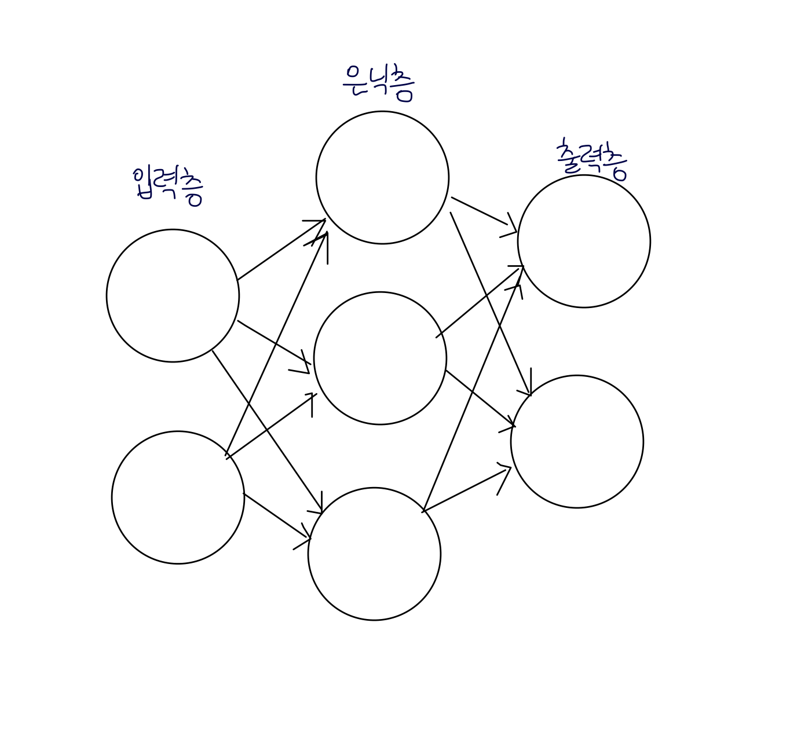
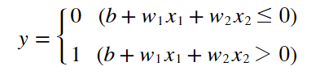
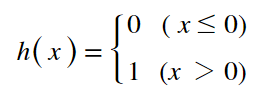
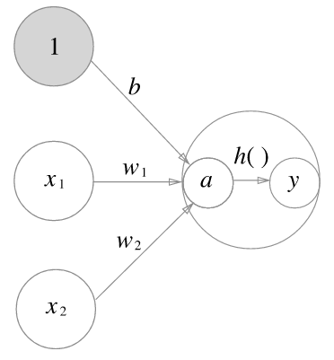
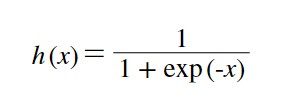
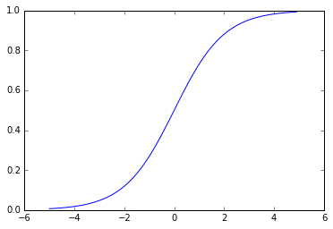

# 신경망

### 3.1.1 신경망의 예


- 큰 그림은 퍼셉트론과 특별히 달라 보이지 않는다.
- 신경망에서 신호를 전달하는 방법에 주목하자

### 3.1.2 퍼셉트론 복습


- 위 수식에서 조건 분기의 동작을 하나의 함수로 생각해보자 h(x) => **활성화함수**






- 지금까지 보던 (0을 넘으면 1을 출력하고 그렇지 않으면 0을 출력) 활성화 함수는 계단함수다.
- 신경망을 시작하면 다른 활성화 함수들을 배우게 된다. 

### 3.2.1 시그모이드 함수
- 신경망에서 자주 이용하는 활성화 함수 
- 어려우면 자세한 수식은 잠시 이해를 접고 단순한 '함수' 로 보고 넘어가기



```python
def sigmoid(x):
    return 1 / (1 + np.exp(-x))

x = np.array([-1.0, 1.0, 2.0])
sigmoid(x)
# array([0.26894142, 0.73105858, 0.88079708])
```



#### 시그모이드와 계단 함수
- 계단 함수보다 매끄러운 결과값이 나온다. 
- 연속적인 실수가 전달이 될 수 있다. 
- 둘다 입력이 작을때 출력은 0에 가깝고 입력이 커지면 출력도 커진다는 공통점이 있다. 