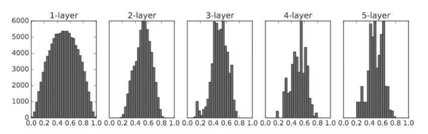

# 학습 관련 기술들

## 확률적 경사 하강법(SGD)
- 매개변수의 기울기를 구해, 기울어진 방향으로 매개변수 값을 갱신
- 위 작업을 반복하며 점점 최적의 값에 다가감
- 비등방성 함수(방향에 따라 성질, 기울기가 달라지는 함수)에서는 탐색 경로가 비효율적

## 모멘텀
- '운동량'을 뜻하는 단어로 물리적 기법
- 기울기 **방향**으로 힘을 받아 물체가 가속된다는 물리 법칙을 이용

## AdaGrad
- 개별 매개변수에 적응적으로 학습률을 조정하면서 학습을 진행
- 과거의 기울기를 제곱하여 계속 더해간다. 

## Adam
- AdagGrad + 모멘텀
- 하이퍼파라미터의 편향 보정이 진행


```
풀어야 할 문제가 무엇이냐에 따라 최적의 갱신 방법이 다르게 존재한다.
하이퍼파라미터를 어떻게 설정하느냐에 따라서도 결과가 바뀐다.
모든 문제에서 항상 뛰어난 기법은 (아직까진)없다.
```

# 가중치의 초깃값
가중치의 초깃값을 무엇으로 설정하느냐가 신경망 학습의 성패를 가르는 일이 실제로 자주 있다. 그만큼 중요!

- 가중치 값을 작게 하여 오버피팅을 일어나지 않게 할 수 있다. 가중치를 작게 만들고 싶다면 초깃값도 최대한 작은 값에서 시작하는 것이 좋다. 하지만 그렇다고 모두 0으로 설정하는 것은 좋지 않은 방법! -> 이유는 오차역전파법에서 모든 가중치의 값이 똑같이 갱신되기 때문
- 은닉층의 활성화값의 분포를 관찰하면 중요한 정보를 얻을 수 있다. 
- 활성화값들이 치우치면 표현력을 제한한다는 관점에서 문제가 된다.
- 각 층의 활성화값은 적당히고루 분포되어야 한다. 층과 층 사이에 적당하게 다양한 테이터가 흐르게 해야 학습이 효율적으로 이뤄지기 때문.

## Xavier 초깃값
- 활성화 함수로 선형함수를 이용할때 이용하면 좋은 초깃값
- 앞 계층의 노드가 n개라면 표준편차가 1/√n 이 되도록 설정.


## He 초깃값
- ReLU 에 특화된 초깃값
- 앞 계층의 노드가 n개라면 표준편차가 √(2/n) 이 되도록 설정. 
- ReLU는 음의 영역이 0이라서 더 넓게 분포시키기 위해 2배의 계수가 필요하다고 해석됨

> 활성화 함수로 ReLU를 사용할 때는 He 초깃값을, sigmoid 나 tanh 등의 선형 함수를 이용할 때는 Xavier 초깃값을 쓰자

# 배치 정규화
- 학습 속도 개선
- 초기값에 크게 의존하지 않는다.
- 오버피팅 억제

참고 링크 - ( https://shuuki4.wordpress.com/2016/01/13/batch-normalization-%EC%84%A4%EB%AA%85-%EB%B0%8F-%EA%B5%AC%ED%98%84/ )

# 오버피팅

> 훈련 데이터에만 지나치게 적응되어 그 외의 데이터에는 제대로 대응하지 못하는 상태.

오버피팅은 아래와 같은 경우에 주로 일어난다.
- 매개변수가 많고 표현력이 높은 모델
- 훈련 데이터가 적음

억제 방법은?

### 가중치 감소
- 오버피팅이 가중치 매개변수의 값이 커서 발생하는 경우가 많다.
- 학습 과정에서 큰 가중치에 대해 그에 상응하는 패널티를 부과하여 억제

### 드롭 아웃
- 신경망 모델이 복잡해지면 가중치 감소만으로는 대응하기 어려워진다.
- 뉴런을 임의로 삭제하면서 학습하는 방법.
- 훈련떄는 데이터를 흘릴 때마다 삭제할 뉴런을 무작위로 선택하고, 시험때는 모든 신호를 전달.
- 단, 시험 때는 각 뉴런의 출력에 훈련 때 삭제한 비율을 곱하여 출력.


# 적절한 하이퍼파라미터 값
하이퍼파라미터 란?
- 학습되어 산출되는 변수가 아니라 미리 사전에 정하고 들어가는 다른 부수적인 값들
- 각 층의 뉴런 수, 배치 크기, 매개변수 갱신 시의 학습률, 가중치 감소 등..

효율적으로 값을 정하기 위해선?
- 검증 데이터를 분리해서 하이퍼파라미터 값의 '좋음'을 시험
- 기존에 훈련 & 시험 데이터로 나누었는데, 시험 데이터로 하면 안되는 이유는? -> 시험 데이터에 오버피팅되기 때문.

### 하이퍼파라미터 최적화
- 0단계 : 하이퍼파라미터 값의 범위를 설정
- 1단계 : 설정된 범위에서 값을 무작위로 추출
- 2단계 : 추출된 값을 사용하여 학습하고, 검증 데이터로 정확도를 평가(단, 에폭은 작게)
- 3단계 : 1,2 단계를 특정 횟수 반복하며, 그 정확도의 결과를 보고 범위를 좁힘